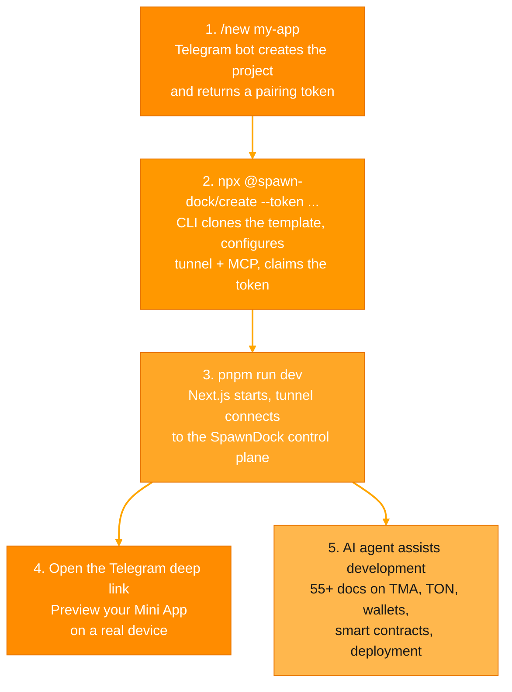
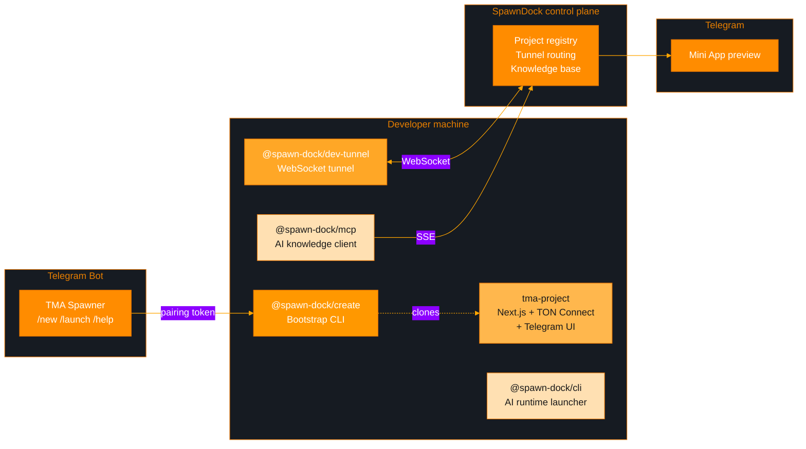

# SpawnDock

**AI-powered development platform**

## TMA Spawner

The first SpawnDock product — a Telegram bot that creates ready-to-code TMA projects in seconds.

Send `/new` to the bot, run one command locally, and get a live Mini App preview right inside Telegram — with an AI agent that knows TMA and TON inside out.

---

### How it works



---

### Quick start

```bash
# The bot gives you a pairing token and a bootstrap command.
# Run it locally:
npx -y @spawn-dock/create@beta --token <pairing-token> my-app

# Start dev server + tunnel:
cd my-app
pnpm run dev

# Open the Telegram deep link printed in the console.
```

---

### What each package does



| Package | Role |
| :--- | :--- |
| [`@spawn-dock/create`](https://github.com/SpawnDock/create-spawn-dock) | Clones the template, applies SpawnDock overlay, claims the pairing token |
| [`@spawn-dock/dev-tunnel`](https://github.com/SpawnDock/dev-tunnel) | Exposes `localhost` to Telegram via the control plane |
| [`@spawn-dock/mcp`](https://github.com/SpawnDock/mcp-client) | Gives AI agents (Claude, Cursor, Codex) access to 55+ docs on TMA and TON |
| [`@spawn-dock/cli`](https://github.com/SpawnDock/cli) | Detects `spawndock.config.json` and launches the configured AI agent |
| [`tma-project`](https://github.com/SpawnDock/tma-project) | Starter template — Next.js + TypeScript + TON Connect + Telegram UI |

---

### Knowledge base

The MCP server gives AI agents searchable access to **55+ documents** (29,500+ lines):

| Area | Topics |
| :--- | :--- |
| **Telegram Mini Apps** | WebApp API, navigation, theming, testing, security, performance |
| **TON Blockchain** | Smart contracts (Tolk / Tact / FunC), jettons, NFTs, DeFi, wallets, DNS, payments |
| **TON Connect** | Wallet integration, authentication, TON Proof |
| **Deployment** | Cloudflare Pages, Vercel, GitHub Pages |
| **Templates** | Shop, game, landing, quiz, menu, portfolio |

---

### License

MIT
