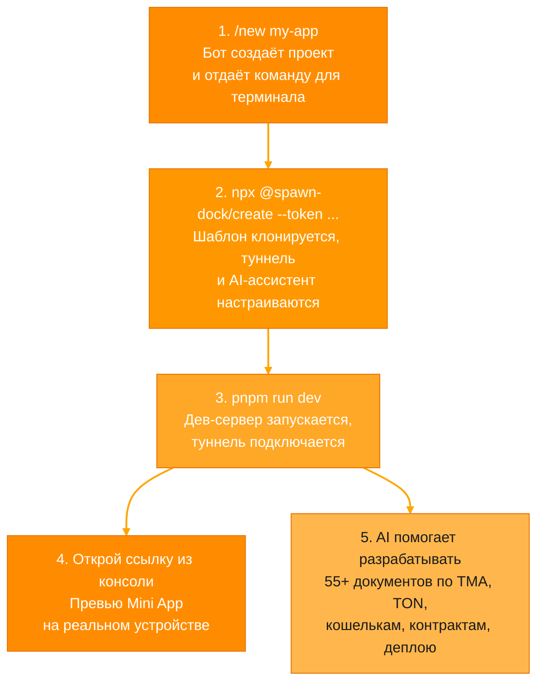
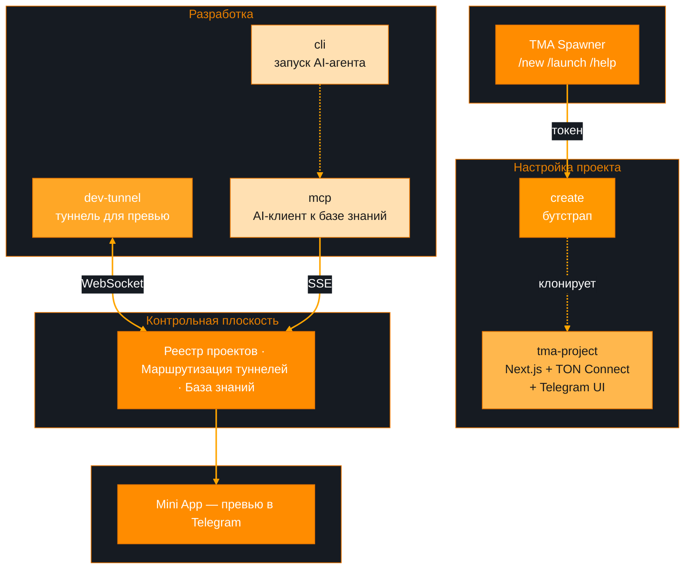

# SpawnDock

**Платформа для создания Telegram Mini Apps на TON blockchain.**

Всё настроено за тебя — шаблон, туннель для превью на телефоне, AI-ассистент с базой знаний по TMA и TON. Напиши боту `/new`, запусти одну команду — и приложение уже работает в Telegram.

---

## TMA Spawner

Telegram-бот, который создаёт проект и выдаёт всё необходимое для старта.



---

## Быстрый старт

```bash
# Бот выдаёт команду с токеном — запусти её:
npx -y @spawn-dock/create@beta --token <pairing-token> my-app

# Запусти дев-сервер и туннель:
cd my-app
pnpm run dev

# В консоли появится ссылка — открой в Telegram.
```

---

## Как устроена платформа



| Пакет | Что делает |
| :--- | :--- |
| [`@spawn-dock/create`](https://github.com/SpawnDock/create-spawn-dock) | Клонирует шаблон, настраивает туннель и MCP, привязывает проект к аккаунту |
| [`@spawn-dock/dev-tunnel`](https://github.com/SpawnDock/dev-tunnel) | Пробрасывает `localhost` в Telegram — превью на телефоне без деплоя |
| [`@spawn-dock/mcp`](https://github.com/SpawnDock/mcp-client) | Даёт AI-агентам (Claude, Cursor, Codex) доступ к 55+ документам по TMA и TON |
| [`@spawn-dock/cli`](https://github.com/SpawnDock/cli) | Запускает AI-агента в песочнице внутри проекта |
| [`tma-project`](https://github.com/SpawnDock/tma-project) | Стартовый шаблон — Next.js + TypeScript + TON Connect + Telegram UI |

---

## База знаний

AI-ассистент работает с **55+ документами** (29 500+ строк):

| Тема | Что покрывает |
| :--- | :--- |
| **Telegram Mini Apps** | WebApp API, навигация, темы, тестирование, безопасность, производительность |
| **TON Blockchain** | Смарт-контракты (Tolk / Tact / FunC), жетоны, NFT, DeFi, кошельки, DNS, платежи |
| **TON Connect** | Подключение кошельков, аутентификация, TON Proof |
| **Деплой** | Cloudflare Pages, Vercel, GitHub Pages |
| **Шаблоны** | Магазин, игра, лендинг, квиз, меню, портфолио |

---

## Лицензия

MIT
