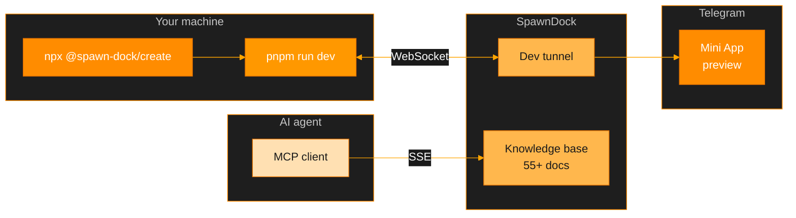
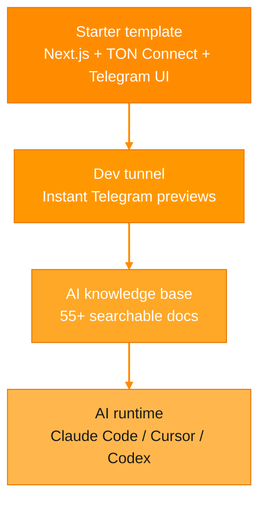

# SpawnDock

**AI-powered development platform for Telegram Mini Apps on the TON blockchain.**

One command to bootstrap a project, get a live preview tunnel,
and let AI agents help you build.

---

## How it works



---

## Quick start

```bash
# 1 — Create a new project
npx -y @spawn-dock/create@beta --token <pairing-token> my-app

# 2 — Start dev server + tunnel
cd my-app
pnpm run dev

# 3 — Open the Telegram deep link printed in the console
```

The CLI scaffolds a **Next.js + TypeScript + TON Connect** app, connects a live tunnel for real-device previews, and wires up MCP so AI agents have full context on TMA and TON APIs.

---

## What you get



| Feature | Details |
| :--- | :--- |
| **Project scaffolding** | Production-ready TMA template with TON Connect wallet integration |
| **Live preview tunnel** | WebSocket tunnel exposes `localhost` to Telegram — test on a real device instantly |
| **AI knowledge base** | 55+ docs on Telegram Mini Apps, TON smart contracts, wallets, deployment, and more |
| **AI runtime** | Sandboxed launcher for Claude Code, Cursor, or Codex with full MCP context |

---

## Packages

| Package | What it does |
| :--- | :--- |
| [`@spawn-dock/create`](https://github.com/SpawnDock/create-spawn-dock) | Scaffolds a new project with tunnel and MCP pre-configured |
| [`@spawn-dock/dev-tunnel`](https://github.com/SpawnDock/dev-tunnel) | Exposes your local dev server for Telegram previews |
| [`@spawn-dock/mcp`](https://github.com/SpawnDock/mcp-client) | Gives AI agents searchable access to the knowledge base |
| [`@spawn-dock/cli`](https://github.com/SpawnDock/cli) | Detects config and launches the AI agent of your choice |
| [`tma-project`](https://github.com/SpawnDock/tma-project) | Starter template every project is built from |

---

## Knowledge base topics

| Area | Covers |
| :--- | :--- |
| **Telegram Mini Apps** | WebApp API, navigation, theming, testing, security, performance |
| **TON Blockchain** | Smart contracts (Tolk / Tact / FunC), jettons, NFTs, DeFi, wallets, DNS, payments |
| **TON Connect** | Wallet integration, authentication, TON Proof |
| **Deployment** | Cloudflare Pages, Vercel, GitHub Pages |
| **Templates** | Shop, game, landing, quiz, menu, portfolio |

---

## License

MIT
