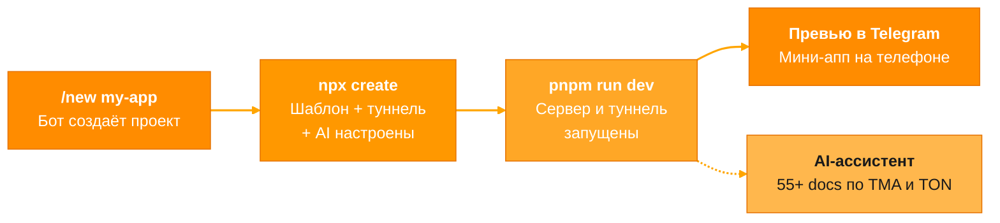

# SpawnDock

**Платформа для создания Telegram Mini Apps на TON blockchain.**
Шаблон, превью-туннель и AI-ассистент — настроены и готовы к работе.



### Быстрый старт

```bash
npx -y @spawn-dock/create@beta --token <pairing-token> my-app
cd my-app && pnpm run dev
# Открой ссылку из консоли в Telegram
```

> Токен выдаёт бот **TMA Spawner** по команде `/new`.

---

### Что внутри

| | Пакет | Роль |
| :---: | :--- | :--- |
| **1** | [`create`](https://github.com/SpawnDock/create-spawn-dock) | Клонирует шаблон, настраивает туннель и AI, привязывает проект |
| **2** | [`tma-project`](https://github.com/SpawnDock/tma-project) | Next.js + TypeScript + TON Connect + Telegram UI |
| **3** | [`dev-tunnel`](https://github.com/SpawnDock/dev-tunnel) | Пробрасывает `localhost` в Telegram — превью без деплоя |
| **4** | [`mcp`](https://github.com/SpawnDock/mcp-client) | 55+ документов по TMA и TON для Claude, Cursor, Codex |
| **5** | [`cli`](https://github.com/SpawnDock/cli) | Запускает AI-агента в песочнице внутри проекта |

<details>
<summary><b>База знаний AI-ассистента</b></summary>

<br>

29 500+ строк документации по всей экосистеме:

| Тема | Покрывает |
| :--- | :--- |
| **Telegram Mini Apps** | WebApp API, навигация, темы, тестирование, безопасность, производительность |
| **TON Blockchain** | Смарт-контракты (Tolk / Tact / FunC), жетоны, NFT, DeFi, кошельки, DNS, платежи |
| **TON Connect** | Подключение кошельков, аутентификация, TON Proof |
| **Деплой** | Cloudflare Pages, Vercel, GitHub Pages |
| **Шаблоны** | Магазин, игра, лендинг, квиз, меню, портфолио |

</details>

---

MIT
